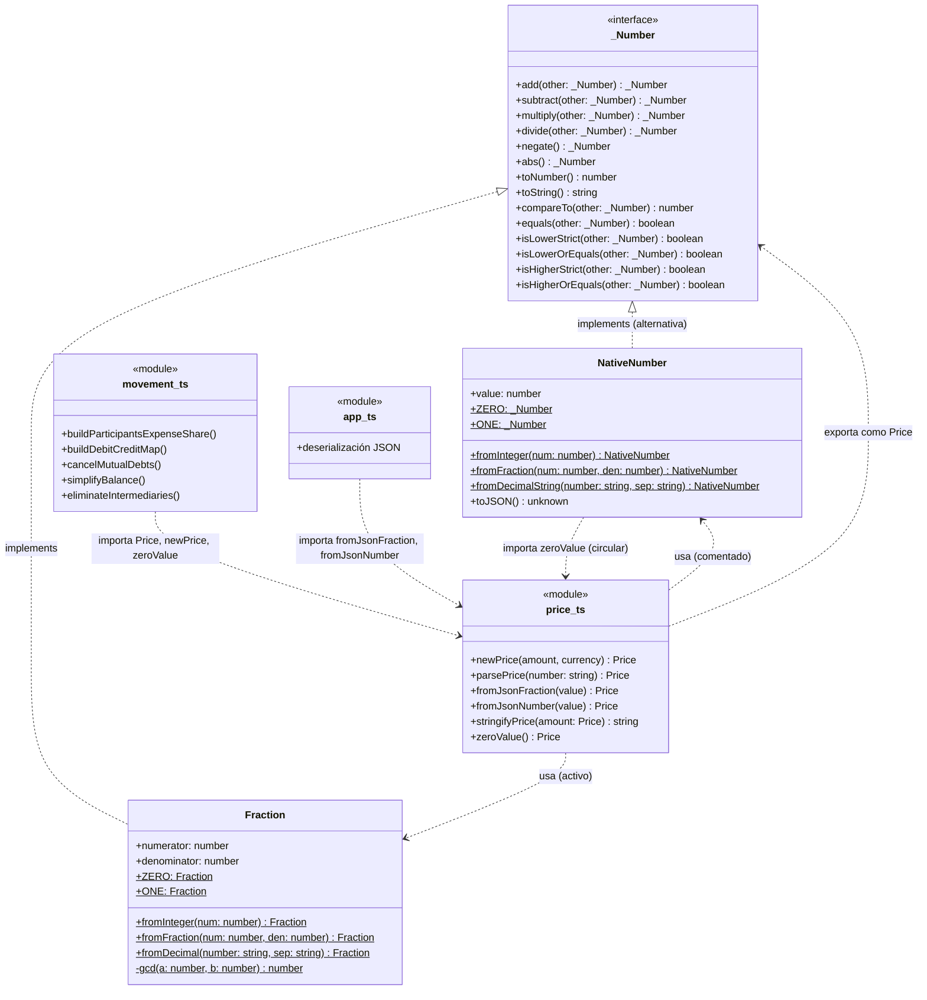
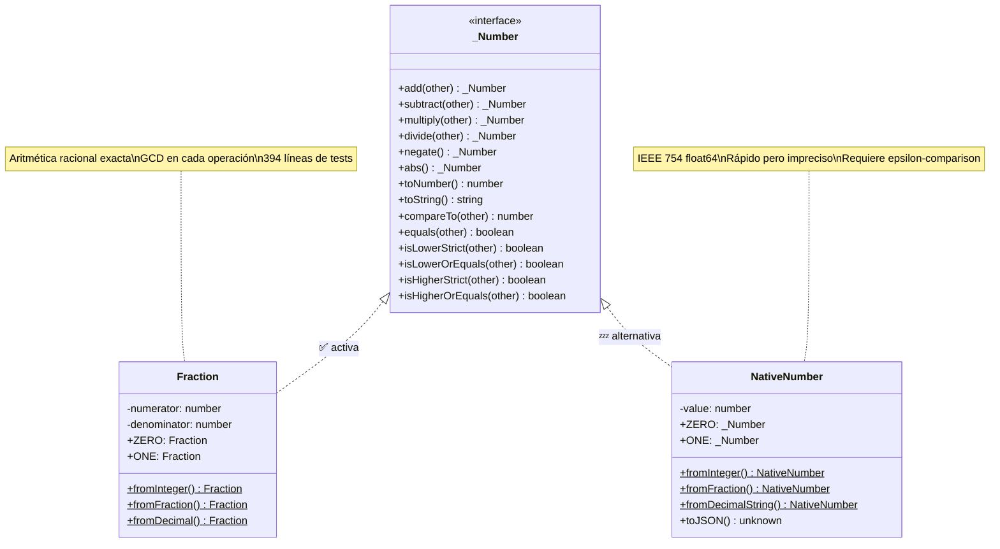
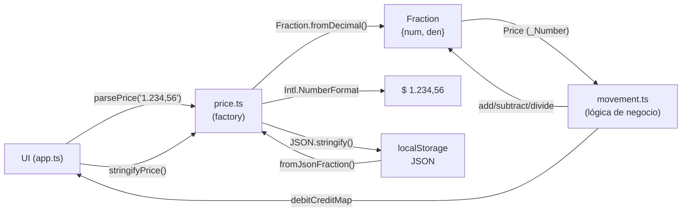

# Análisis de la Familia de Tipos de Precios en Splitifly

## 1. Arquitectura Actual — Mapa de Tipos

### Archivos clave

| Archivo | Rol |
|---------|-----|
| `assets/ts/util/number.ts` | Interfaz `_Number` (contrato) + clase `NativeNumber` |
| `assets/ts/util/fraction.ts` | Clase `Fraction` (implementación activa) |
| `assets/ts/model/price.ts` | Alias `Price = _Number` + funciones factory |
| `assets/ts/model/movement.ts` | Consumidor principal (lógica de negocio de deudas) |
| `assets/ts/app/app.ts` | Serialización/deserialización JSON |

### Diagrama de dependencias



### Diagrama ASCII art (versión simplificada)

```
                          ┌──────────────────────┐
                          │    _Number (interfaz) │
                          │   14 operaciones      │
                          └──────────┬─────────────┘
                                     │ implements
                       ┌─────────────┴─────────────┐
                       │                            │
              ┌────────┴────────┐          ┌────────┴────────┐
              │    Fraction     │          │  NativeNumber   │
              │   (ACTIVA)      │          │  (alternativa)  │
              │ numerator/denom │          │    value        │
              └────────┬────────┘          └────────┬────────┘
                       │                            │
                       └─────────────┬──────────────┘
                                     │ usada por
                          ┌──────────┴─────────────┐
                          │     price.ts            │
                          │  type Price = _Number   │
                          │  newPrice()             │
                          │  parsePrice()           │
                          │  fromJsonFraction()     │
                          │  zeroValue()            │
                          └──────────┬─────────────┘
                                     │ importada por
                       ┌─────────────┴─────────────┐
                       │                            │
              ┌────────┴────────┐          ┌────────┴────────┐
              │  movement.ts    │          │    app.ts       │
              │ lógica deudas   │          │ JSON serialize  │
              └─────────────────┘          └─────────────────┘
```

---

## 2. Patrones de Diseño Identificados

### a) Strategy Pattern (núcleo del diseño)

La interfaz `_Number` define el contrato con **14 operaciones aritméticas y de comparación**. `Fraction` y `NativeNumber` son las dos estrategias concretas. El "switch" entre estrategias se hace manualmente comentando/descomentando bloques de funciones factory en `price.ts` (líneas 46-82 vs 84-114).

### b) Factory Method Pattern

Funciones factory en `price.ts` encapsulan toda la creación de instancias:
- `newPrice(amount, currency)` — crea desde entero
- `parsePrice(number)` — parsea desde string con formato argentino (separador `,`)
- `fromJsonFraction(value)` — deserializa desde `{numerator, denominator}`
- `fromJsonNumber(value)` — deserializa desde escalar (compatibilidad con versiones anteriores)
- `zeroValue()` — singleton del valor cero

Cada implementación concreta expone métodos estáticos adicionales:
- `Fraction.fromInteger()`, `Fraction.fromFraction()`, `Fraction.fromDecimal()`
- `NativeNumber.fromInteger()`, `NativeNumber.fromFraction()`, `NativeNumber.fromDecimalString()`

### c) Value Object Pattern (DDD)

Las instancias de `Fraction` y `NativeNumber` son **value objects**:
- **Inmutabilidad**: todas las operaciones (`add`, `subtract`, etc.) retornan nuevas instancias; nunca mutan el estado interno.
- **Igualdad por valor**: `equals()` compara contenido semántico, no referencia de objeto.
- **Sin identidad**: no tienen ID; dos `Fraction(1,2)` son indistinguibles.
- **Seguridad en colecciones**: la inmutabilidad los hace seguros como valores en `Map<number, Price>` (ver comentario en `movement.ts:98-100`).

### d) Type Alias para Semántica de Dominio

```ts
export type Price = _Number;  // price.ts:4
```

Da significado de dominio ("precio") sin crear un tipo nuevo. Todo el código de negocio habla de `Price`, no de `_Number`.

### e) Singleton para Constantes

- `Fraction.ZERO` y `Fraction.ONE` — instancias únicas reutilizadas
- `NativeNumber.ZERO` y `NativeNumber.ONE` — equivalentes para la implementación alternativa
- `newPrice()` retorna los singletons cuando `amount === 0` o `amount === 1`

---

## 3. Evaluación Crítica del Diseño

### Fortalezas

1. **Abstracción limpia**: la interfaz `_Number` permite swap teórico de implementación sin cambiar consumidores (`movement.ts`, `app.ts`).
2. **Inmutabilidad**: garantiza safety en Maps, copias shallow y operaciones concurrentes.
3. **Factory functions centralizadas**: toda la creación pasa por `price.ts`, un único punto de cambio.
4. **Tests exhaustivos**: `fraction.test.ts` tiene 394 líneas de tests para `Fraction`.
5. **Compatibilidad JSON bidireccional**: `app.ts` soporta tanto `fromJsonFraction` como `fromJsonNumber`, lo que permite migrar datos entre formatos.

### Debilidades y oportunidades de mejora

#### a) Acoplamiento con `as unknown as Fraction` (type casting inseguro)

En cada operación binaria de ambas implementaciones se usa un cast inseguro:

```ts
// fraction.ts:48
add(_other: _Number): Fraction {
  const other = _other as unknown as Fraction  // ⚠️ double cast
  // ...
}
```

Esto **rompe el contrato de la interfaz**: NO se pueden mezclar `Fraction` + `NativeNumber` en la misma operación aritmética. La interfaz promete polimorfismo (`add(other: _Number)`), pero la implementación asume que `other` es del mismo tipo concreto.

**Impacto práctico**: nulo, porque se usa una sola implementación a la vez. Pero es un "smell" que indica que la abstracción es más estrecha de lo que la interfaz sugiere.

#### b) Switch por comentarios en vez de configuración

El cambio de implementación requiere comentar/descomentar ~30 líneas en `price.ts`. Ya existe un boceto de interfaz `PriceBuilder` (comentado en `price.ts:5-44`) que formalizaría el Strategy Pattern, pero no está implementado.

#### c) Dependencia circular entre `number.ts` y `price.ts`

```
number.ts (línea 1) → importa zeroValue de price.ts
price.ts  (línea 2) → importa _Number de number.ts
```

`NativeNumber.abs()` necesita `zeroValue()` para comparar si el valor es negativo, y `zeroValue()` vive en `price.ts`. Esto funciona en TypeScript (resolución lazy de módulos), pero es una señal de acoplamiento circular.

**Nota**: `Fraction.abs()` no tiene esta dependencia — usa `this.numerator > 0` directamente.

#### d) Falta `toJSON()` explícito en `Fraction`

`NativeNumber` tiene `toJSON()` (línea 135) que retorna el valor escalar, pero `Fraction` no lo implementa. La serialización funciona porque `JSON.stringify()` serializa `{numerator, denominator}` por defecto al encontrar propiedades públicas, pero este comportamiento es **implícito** y podría romperse si se agregan propiedades internas.

---

## 4. Viabilidad de Usar IEEE 754 Float64 (`NativeNumber`)

### Estado actual: ya implementado

La clase `NativeNumber` en `number.ts` ya implementa completamente la interfaz `_Number`, y las funciones factory alternativas están comentadas en `price.ts` (líneas 84-114). El switch es mecánico: descomentar un bloque y comentar el otro.

### Trade-offs

| Aspecto | Fraction | NativeNumber (IEEE 754) |
|---------|----------|------------------------|
| Precisión | Exacta (aritmética racional) | Aproximada (errores de redondeo) |
| Rendimiento | Más lento (GCD en cada op) | Nativo del engine, muy rápido |
| Memoria | 2 numbers + overhead de objeto | 1 number + overhead de objeto |
| Serialización | `{numerator, denominator}` | Valor escalar simple |
| Caso problemático | Ninguno | `0.1 + 0.2 = 0.30000000000000004` |
| `toJSON()` | Implícito (propiedades públicas) | Explícito (`toJSON()` definido) |

### Riesgo real para Splitifly

El impacto principal está en la lógica de simplificación de deudas en `movement.ts`:

1. **División inexacta**: dividir $100 entre 3 personas con `Fraction` es exacto (`100/3`). Con float: `33.33333333333333`, y la suma da `99.99999999999999` en vez de `100`.

2. **Comparaciones con cero**: `simplifyBalance()`, `cancelMutualDebts()`, `eliminateIntermediaries()` y `countNonZeroDebts()` usan extensivamente `equals(zeroValue())` e `isHigherStrict(zeroValue())`. Con float, valores como `0.0000000000001` (residuo de redondeo) **no serían iguales a cero**, provocando:
   - Deudas "fantasma" de centavos invisibles
   - Loops adicionales innecesarios en `simplifyBalance()`
   - Cadenas de intermediarios que no se eliminan correctamente

3. **Presentación**: `Intl.NumberFormat` con 2-4 decimales (`price.ts:69-74`) oculta el error visualmente, pero la lógica interna opera con los valores sin redondear.

---

## 5. Recomendaciones Basadas en Patrones Modernos

### a) Formalizar el Strategy Pattern con inyección

Implementar la interfaz `PriceBuilder` ya bocetada en `price.ts:5-44`:

```ts
interface PriceBuilder {
  newPrice(amount: number, currency: string): Price
  fromJsonFraction(value: any): Price
  fromJsonNumber(value: any): Price
  parsePrice(number: string): Price
  stringifyPrice(amount: Price): string
  zeroValue(): Price
}

const priceOps: PriceBuilder = new PriceFractionBasedBuilder();
// Cambiar a: new PriceNativeNumberBasedBuilder() para IEEE 754
```

Ventajas: permite cambiar implementación sin tocar comentarios, facilita testing con mocks.

### b) Resolver el casting inseguro

Tres opciones posibles:

| Opción | Descripción | Trade-off |
|--------|-------------|-----------|
| 1. Documentar | Aceptar que `_Number` es un contrato "mismo-tipo" | Simple, pragmático |
| 2. Puente `toNumber()` | Usar `toNumber()` como valor intermedio universal | Pierde la precisión de Fraction |
| 3. Double dispatch | Implementar visitor pattern para operaciones mixtas | Complejo, probablemente innecesario |

**Recomendación**: opción 1 — documentar la restricción en la interfaz con un comentario.

### c) Si se migra a `NativeNumber`: agregar epsilon-comparison

```ts
const EPSILON = 1e-10;

equals(_other: _Number): boolean {
  const other = _other as unknown as NativeNumber;
  return Math.abs(this.value - other.value) < EPSILON;
}

// Análogo para isLowerStrict, isHigherStrict, etc.
isHigherStrict(_other: _Number): boolean {
  const other = _other as unknown as NativeNumber;
  return this.value - other.value > EPSILON;
}
```

Sin esto, las funciones `cancelMutualDebts()`, `simplifyBalance()` y `countNonZeroDebts()` fallarían silenciosamente.

### d) Romper la dependencia circular `number.ts` ↔ `price.ts`

`NativeNumber.abs()` depende de `zeroValue()` importado de `price.ts`. Soluciones posibles:

1. **Inline la comparación** (como hace `Fraction`): `if (this.value < 0)` en vez de `if (this.isLowerStrict(zeroValue()))`
2. **Mover `zeroValue()`** a un archivo de constantes compartido
3. **Pasar zero como parámetro** en vez de importarlo

---

## 6. Diagramas de Resumen

### Diagrama de Clases (Mermaid)



### Flujo de Datos (Mermaid)



### Diagrama ASCII art — Flujo de datos

```
  ┌─────────┐    parsePrice()     ┌───────────┐    fromDecimal()    ┌──────────┐
  │   UI    │ ──────────────────> │ price.ts  │ ─────────────────> │ Fraction │
  │ (app.ts)│                     │ (factory) │                     │ {n/d}    │
  └────┬────┘                     └─────┬─────┘                     └────┬─────┘
       │                                │                                │
       │ stringifyPrice()               │ Price (= _Number)             │ add/sub/div
       │ <──────────────────────────────┘                                │
       │                                                                 ▼
       │                                                          ┌──────────────┐
       │    debitCreditMap                                        │ movement.ts  │
       │ <─────────────────────────────────────────────────────── │ (negocio)    │
       │                                                          └──────────────┘
       │
       ▼
  ┌──────────────┐
  │ $ 1.234,56   │  (Intl.NumberFormat es-AR)
  └──────────────┘
```
